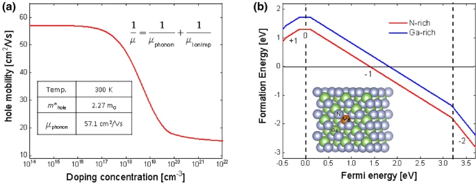
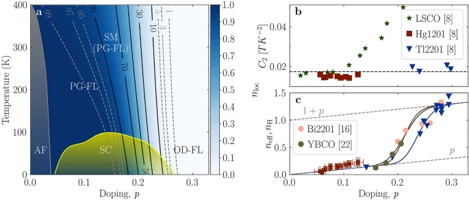

## Procedure

*   Gather the required equipment:
    *   Semiconductor sample (e.g., silicon or germanium)
    *   Temperature-controlled chamber (e.g., cryostat or furnace)
    *   Four-point probe setup
    *   Digital multimeter
    *   Data acquisition system
    *   Graphing software
    *   Protective equipment (gloves, safety glasses)

 
  
**Fig. 1. The calculated defect formation energy of Mg substitution for Ga as a function of Fermi energy**

  

*   Set up the circuit for forward bias:
    *   Connect the anode of the diode to the positive terminal of the power supply.
    *   Connect the cathode of the diode to one terminal of the ammeter.
    *   Connect the other terminal of the ammeter to the negative terminal of the power supply.
    *   Connect the voltmeter across the diode to measure the voltage drop.

Procedure
---------

  
**Fig. 2. Transport properties and doping evolution of the Fermi surface in cuprates**

  

1.  **Preparation:**
    *   Ensure the semiconductor sample is clean and properly mounted in the four-point probe setup.
    *   Verify that the temperature-controlled chamber is functioning correctly.
2.  **Initial Measurements:**
    *   Record the initial temperature of the semiconductor sample.
    *   Measure and record the resistance of the semiconductor sample at this temperature.
3.  **Temperature Variation:**
    *   Gradually increase the temperature of the semiconductor sample in predefined steps (e.g., 10°C intervals).
    *   Allow the sample to stabilize at each temperature before taking measurements.
    *   At each temperature, measure the resistance of the sample using the digital multimeter.
4.  **Data Collection:**
    *   Record the temperature and corresponding resistance values in a data table.
5.  **Analysis:**
    *   Plot the resistance versus temperature data to determine the relationship between temperature and carrier concentration.
    *   Analyze how the Fermi energy level shifts with temperature based on the observed changes in resistance.
6.  **Conclusion:**
    *   Summarize the findings regarding the variation of the Fermi energy level and carrier concentration with temperature.
    *   Discuss any deviations from theoretical expectations and potential sources of error.
