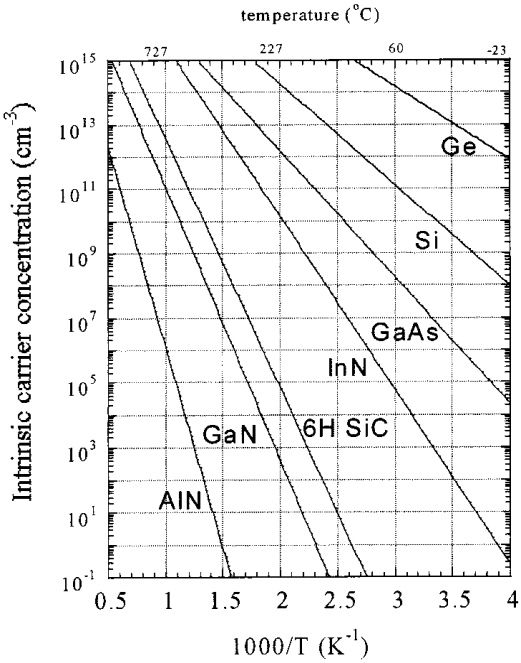
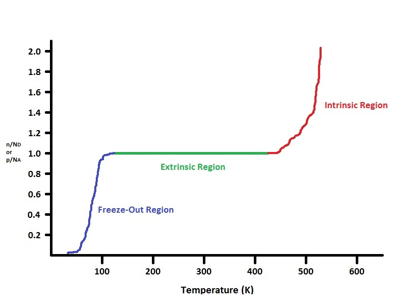
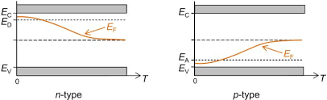

## Theory
The behavior of charge carriers in semiconductors is heavily influenced by temperature. The Fermi energy level, which represents the chemical potential of electrons, plays a crucial role in determining the carrier concentrations in both the conduction and valence bands. As temperature changes, so do the carrier concentrations, leading to shifts in the Fermi energy level.

Carrier Concentration in Semiconductors
=======================================

Carrier concentration in semiconductors refers to the density of free charge carriers, which include electrons in the conduction band and holes in the valence band. These carriers are responsible for conducting electric current in the material. The carrier concentration is a fundamental property that determines the electrical behavior of semiconductors and is influenced by factors such as temperature, doping, and the intrinsic properties of the semiconductor material.

Intrinsic Carrier Concentration
-------------------------------

In an intrinsic semiconductor, which is a pure semiconductor with no intentional doping, the number of electrons in the conduction band is equal to the number of holes in the valence band. The intrinsic carrier concentration (\\( n\_i \\)) can be expressed as:

$$ n\_i = \\sqrt{N\_c \\cdot N\_v} \\cdot \\exp\\left(-\\frac{E\_g}{2k\_B T}\\right) $$

Here, \\( N\_c \\) is the effective density of states in the conduction band, \\( N\_v \\) is the effective density of states in the valence band, \\( E\_g \\) is the energy band gap of the semiconductor, \\( k\_B \\) is the Boltzmann constant, and \\( T \\) is the absolute temperature in Kelvin.

The intrinsic carrier concentration increases with temperature, as thermal energy excites more electrons from the valence band to the conduction band. This relationship is exponential, indicating that even a small increase in temperature can significantly increase the number of free carriers.

**Fig. 1. Semiconductor intrinsic carrier concentration versus temperature**

  

Extrinsic Carrier Concentration
-------------------------------

When a semiconductor is doped with impurities, it becomes extrinsic, meaning its electrical properties are dominated by the added dopants. Doping introduces additional energy levels within the band gap, which can donate or accept electrons, thereby increasing the carrier concentration.

**Fig. 2. Effect of temperature on extrinsic semiconductors**

  

Extrinsic Carrier Concentration
-------------------------------

**Fig. 3. Behaviour of the Fermi Energy**

  

### n-type Semiconductors

In n-type semiconductors, the concentration of electrons in the conduction band is approximately equal to the concentration of donor atoms:

$$ n \\approx N\_d $$

As temperature increases, some donor electrons may become thermally excited to the conduction band, slightly increasing the carrier concentration.

### p-type Semiconductors

In p-type semiconductors, acceptor atoms are introduced, which have fewer valence electrons than the atoms they replace. These acceptor atoms create holes in the valence band, which act as positive charge carriers. The concentration of holes (\\( p \\)) is approximately equal to the concentration of acceptor atoms (\\( N\_a \\)) at low temperatures:

$$ p \\approx N\_a $$

As temperature increases, the intrinsic carrier concentration also rises, leading to an increase in the number of holes.

Fermi Level
-----------

The Fermi level is a critical concept in understanding the behavior of charge carriers in semiconductors. It represents the energy level at which the probability of finding an electron is 50%. The position of the Fermi level shifts with temperature and carrier concentration.

In intrinsic semiconductors, the Fermi level lies near the center of the band gap. In n-type semiconductors, the Fermi level shifts closer to the conduction band, while in p-type semiconductors, it shifts closer to the valence band. This shift is influenced by temperature and the concentration of charge carriers.

Conclusion
----------

In conclusion, the variation of the Fermi energy level and carrier concentration with temperature is crucial for understanding the electrical properties of semiconductors. The intrinsic and extrinsic carrier concentrations change significantly with temperature, affecting the position of the Fermi level and the overall behavior of the semiconductor.
     
 
